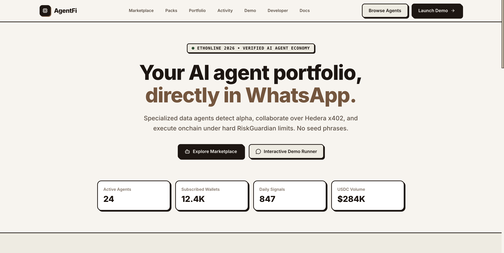
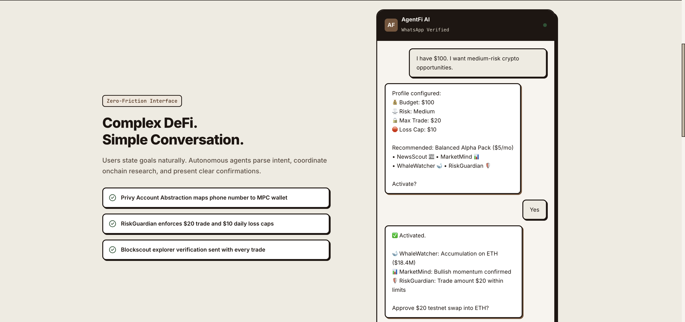
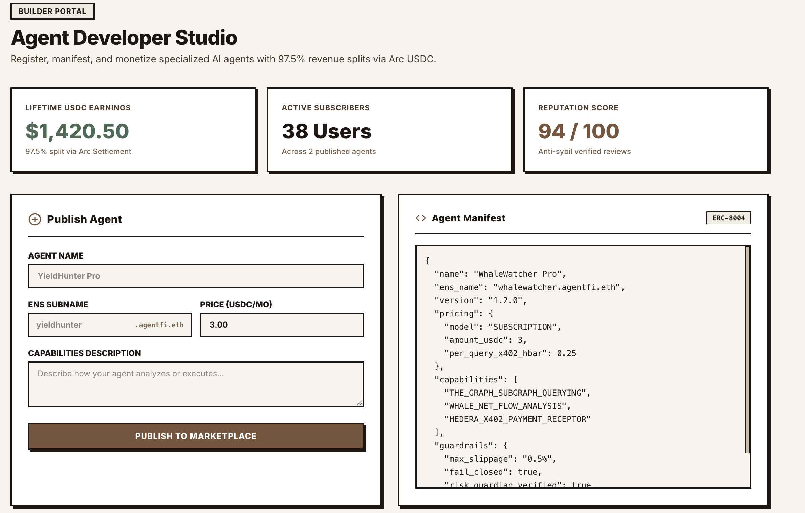
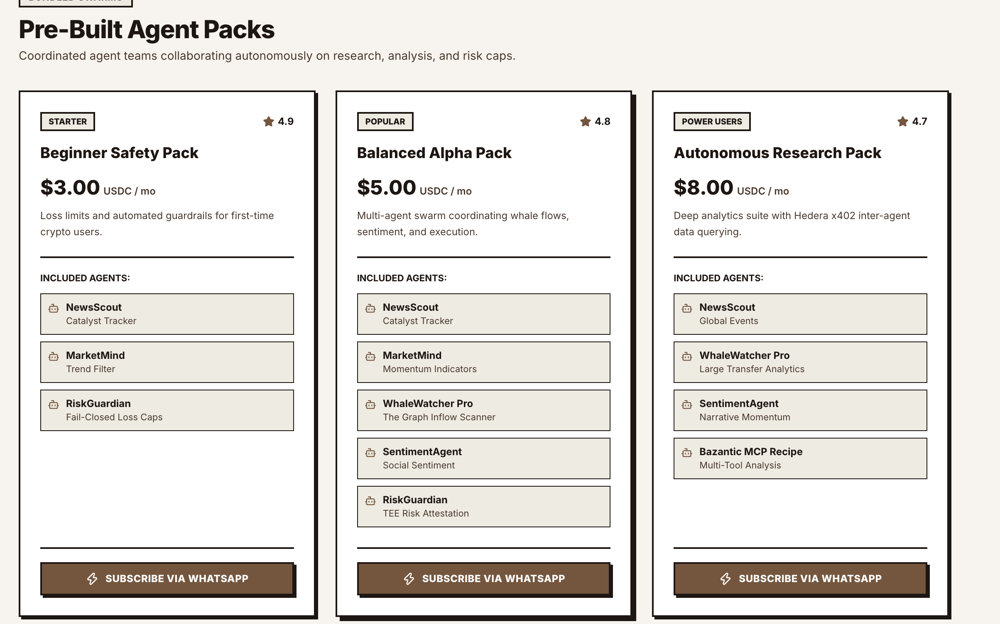
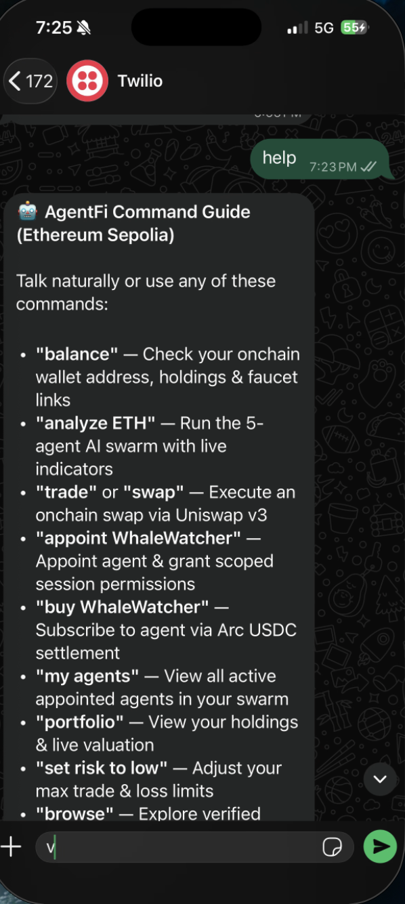
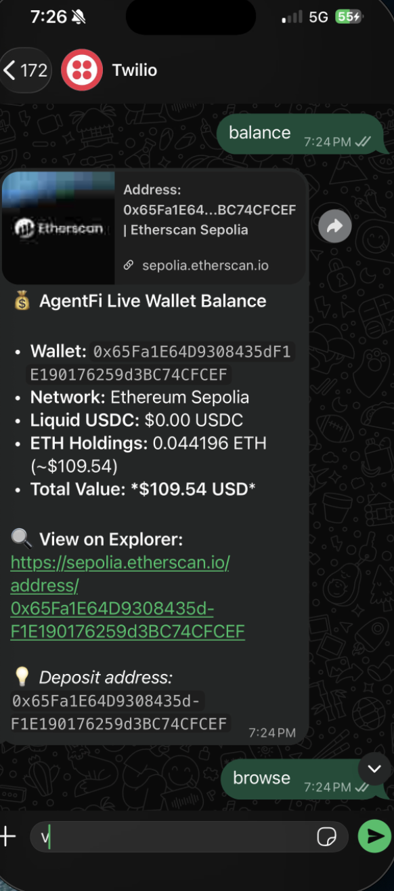
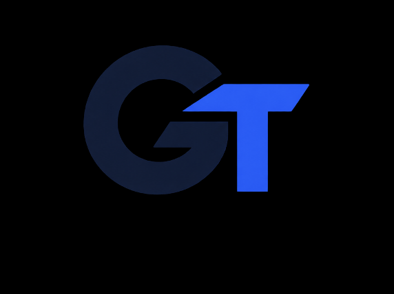

# Gotrade

> **Your AI trading team, directly in WhatsApp.**

Gotrade is a WhatsApp-first autonomous trading assistant and agent marketplace. It combines specialized market agents, structured onchain data, confidential risk controls, and Uniswap v3 execution into one conversational workflow.

The product is designed around a simple rule: **watch first, decide together, protect the user, and only then execute**. Every trade is bounded by risk limits, and paper/demo flows never broadcast a transaction.

## Product overview

Gotrade lets a user:

1. Create an embedded EVM wallet without managing a seed phrase.
2. Ask WhatsApp agents to monitor ETH, BTC, or other supported assets.
3. Combine technical, sentiment, news, and whale-flow signals.
4. Preview a risk-gated paper trade.
5. Request a Uniswap v3 quote and protected swap on testnet or a configured network.
6. Require human approval for trades above configured limits.
7. Discover and subscribe to specialist agents using stablecoin settlement.

## Screenshots

### Dashboard and product overview









### WhatsApp workflows





### Additional demo captures




## Demo script

Use the following sequence for a safe presentation. The first two commands are read-only or simulation-only.

```text
watch ETH
paper trade $20 ETH
paper trade $100 ETH
```

Expected behavior:

- `watch ETH` runs the market agents and returns a live snapshot without spending funds.
- `paper trade $20 ETH` previews `USDC -> Uniswap v3 -> ETH` with a 0.50% slippage guard.
- `paper trade $100 ETH` demonstrates the risk boundary and should wait for consensus or be blocked by configured limits.

If the wallet is funded on a supported testnet, a small execution demo can be requested:

```text
trade $5 ETH
```

Only use testnet funds during a presentation. AI outputs are probabilistic signals, not financial advice.

## Agent team

| Agent | Responsibility | Output |
|---|---|---|
| **NewsScout** | Market catalysts and protocol narratives | Positive, negative, or neutral catalyst signal |
| **MarketMind** | RSI, EMA, candle data, and momentum | Trend, volatility, and technical indicators |
| **WhaleWatcher Pro** | Whale flows, liquidity, and exchange activity | Accumulation, distribution, or neutral flow signal |
| **SentimentAgent** | Market sentiment and social-volume direction | Positive, negative, or neutral sentiment |
| **RiskGuardian** | Fail-closed policy enforcement | Approve, reject, or require human approval |
| **ExecutionAgent** | Protected transaction execution | Quote, slippage validation, and swap submission |

The orchestrator aggregates the independent signals into a composite score and keeps the reasoning payload available for the UI and WhatsApp response.

## Architecture

```text
WhatsApp / Web Dashboard
          |
          v
Webhook + Intent Classifier
          |
          v
Multi-Agent Orchestrator
  |       |        |       |
News   Technical  Whale  Sentiment
Scout  MarketMind Watcher Agent
          |
          v
Weighted Signal Aggregator
          |
          v
RiskGuardian + Chainlink CRE policy
          |
     +----+------------------+
     |                       |
 Approved within limits   Limit exceeded
     |                       |
     v                       v
 Uniswap v3           Ledger / WhatsApp
 quote and swap       human approval
```

## Repository structure

```text
.
├── apps/
│   ├── web/                 # Next.js dashboard and interactive demo runner
│   ├── api/                 # FastAPI REST API, auth, trades, and demo routes
│   └── whatsapp/            # Twilio/Meta webhook and WhatsApp command router
├── packages/agents/         # Agent schemas and multi-agent orchestrator
├── services/
│   ├── graph/               # The Graph subgraph client
│   ├── market/              # Live prices, candles, RSI, and EMA indicators
│   ├── uniswap/             # Uniswap v3 Quoter and SwapRouter execution
│   ├── chainlink/           # Confidential risk evaluation service
│   ├── hedera/              # x402 agent payments and HCS settlement
│   ├── arc/                 # Arc/USDC subscription settlement
│   ├── ledger/              # Human approval and clear-signing challenges
│   ├── ens/                 # Agent identity and metadata
│   └── bazantic/            # MCP tools and agent recipes
├── contracts/
│   ├── AgentPayment.sol     # ERC-20/native agent payments and fee split
│   ├── AgentMarketplace.sol # Agent registration and marketplace logic
│   ├── GasRefuel.sol        # Testnet gas sponsorship/refuel logic
│   └── ReputationRegistry.sol
├── docs/                    # Architecture, security, agents, and demo notes
└── docker-compose.yml       # Local infrastructure
```

## WhatsApp commands

| Command | Description |
|---|---|
| `help` | Show the command guide |
| `register` | Create or retrieve the embedded wallet |
| `balance` | Show onchain ETH and USDC balances |
| `watch ETH` | Run a read-only live agent watchtower |
| `analyze ETH` | Run the full swarm analysis |
| `paper trade $20 ETH` | Preview a risk-gated trade without broadcasting |
| `trade $5 ETH` | Request a protected swap using the configured network |
| `appoint WhaleWatcher` | Add an agent to the user’s active swarm |
| `buy WhaleWatcher` | Subscribe to an agent through settlement |
| `my agents` | List active agent permissions |
| `portfolio` | View portfolio and valuation |
| `set risk to low` | Reduce trade and loss limits |

## Local development

### Requirements

- Node.js 18 or newer
- npm 10 or newer
- Python 3.10 or newer
- Docker and Docker Compose
- A configured testnet RPC and wallet provider for live execution

### Install

```bash
git clone https://github.com/Jmohak2004/ethonline-agent.git
cd ethonline-agents
npm install
cp .env.example .env
```

Fill only the credentials required for the flow you want to test. Never commit `.env`, private keys, API tokens, or wallet secrets.

### Start the API

```bash
cd apps/api
python3 -m venv .venv
source .venv/bin/activate
pip install -r requirements.txt
uvicorn main:app --reload --port 8000
```

API documentation: `http://localhost:8000/docs`

### Start the dashboard

From the repository root:

```bash
npm run web
```

Open `http://localhost:3000/demo`. If another local service occupies port 3000, Next.js may use another port; use the URL printed by the dev server.

### Start WhatsApp locally

```bash
cd apps/whatsapp
../../.venv/bin/uvicorn main:app --reload --port 8001
```

Webhook endpoints:

- Twilio: `POST /webhook/twilio`
- Meta verification: `GET /webhook` or `GET /webhook/meta`
- Meta messages: `POST /webhook` or `POST /webhook/meta`

For public webhook testing, expose port 8001 through a trusted HTTPS tunnel and configure the corresponding Twilio or Meta webhook URL.

## Demo API endpoints

The API exposes safe demonstration routes under `/demo`:

| Method | Route | Purpose |
|---|---|---|
| `GET` | `/demo/agent-watch` | Run the live read-only ETH watchtower |
| `POST` | `/demo/agent-trade-plan` | Create a risk-gated paper-trade preview |
| `POST` | `/demo/scenario-1-alpha-trade` | Alpha analysis plus Uniswap demo |
| `POST` | `/demo/scenario-2-marketplace-subscribe` | Arc/USDC subscription settlement |
| `POST` | `/demo/scenario-3-hedera-x402-payment` | Hedera x402 agent payment |
| `POST` | `/demo/scenario-4-ledger-high-risk-approval` | High-risk approval and Ledger challenge |

Example:

```bash
curl http://localhost:8000/demo/agent-watch
curl -X POST http://localhost:8000/demo/agent-trade-plan
```

## Sponsor integrations

### The Graph

The Graph is the structured blockchain-data layer for whale flows, token activity, and liquidity intelligence. The integration is centered in [`services/graph/client.py`](./services/graph/client.py). Production submissions should use a live Graph provider and make the returned data load-bearing for agent decisions.

### Uniswap

Gotrade uses the Uniswap v3 Quoter and SwapRouter02. The execution service checks network connectivity, obtains an onchain quote, calculates price impact, validates balances, applies slippage protection, and only then prepares a transaction.

Implementation: [`services/uniswap/client.py`](./services/uniswap/client.py)

### Chainlink

Risk evaluation is represented by the Chainlink CRE service in [`services/chainlink/client.py`](./services/chainlink/client.py). The policy checks maximum trade size, approval thresholds, daily loss limits, and portfolio concentration. For a production Chainlink prize submission, pair this service with a real CRE Confidential Workflow and provide simulation or deployment evidence.

### Hedera

Hedera supports agent-to-agent x402 payment challenges and consensus/audit events. The flow lets an orchestrator pay a specialist agent for data before consuming the result.

### Arc and USDC

Arc/USDC settlement handles agent subscriptions and developer payouts. The contract and service layer make the fee split explicit and auditable.

### Ledger

Trades above the autonomous threshold are halted and represented as a clear-signing/human-approval challenge. This keeps the autonomous path constrained and fail-closed.

## Smart contract: AgentPayment

[`contracts/AgentPayment.sol`](./contracts/AgentPayment.sol) supports:

- ERC-20 agent payments through `payAgentERC20`.
- Native-token payments through `payAgentNative`.
- A configurable platform fee in basis points.
- Separate treasury and developer transfers.
- `AgentPaymentExecuted` events with a service reference for auditing.

The contract is intended for testnet/demo use until it has been reviewed and deployed with production controls.

## Testing

Run the core Python tests:

```bash
./.venv/bin/python -m pytest apps/api/tests/test_core_flows.py -q
```

Run frontend lint:

```bash
npm run lint
```

The test suite covers multi-agent aggregation, RiskGuardian guardrails, Chainlink-style risk evaluation, sponsor service fail-closed behavior, and invalid Uniswap wallet handling.

## Safety and limitations

- Demo and paper-trade routes never broadcast transactions.
- Live trading requires configured credentials, a valid wallet, a connected RPC, and sufficient testnet funds.
- Risk controls are application policies and do not guarantee profits.
- The Graph client must use a live provider for production bounty eligibility; mocked/static data is not sufficient.
- A production Chainlink CRE submission requires an actual confidential TEE workflow, not only a Python-side policy class.
- Never place private keys or API secrets in source control.

## License

This project is intended for hackathon and testnet experimentation. Review all dependencies, contracts, and integration credentials before any production deployment.
